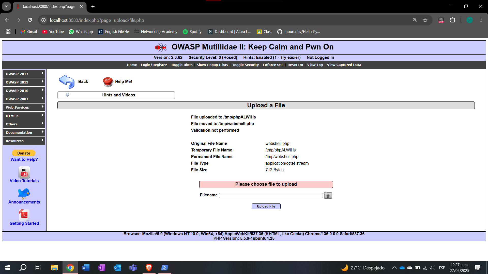
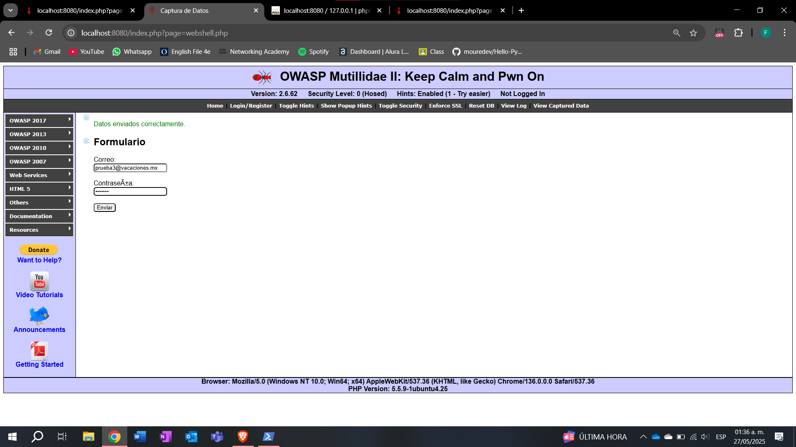
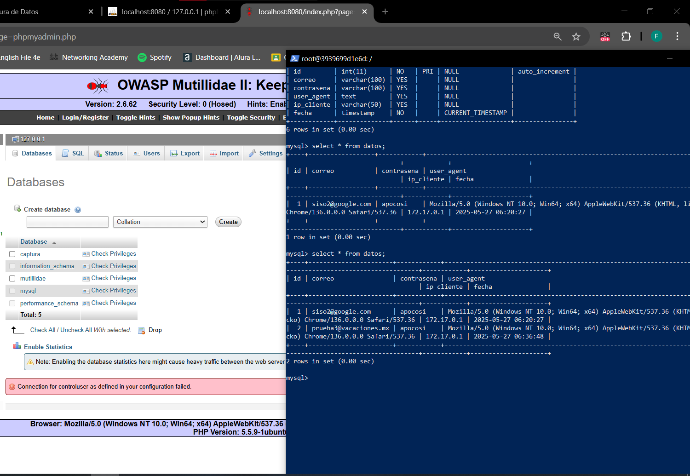

Crear un webshell en PHP para capturar correo, contraseña y user-agent desde Mutillidae, almacenando los datos en una base de datos MySQL en un entorno Docker.

Resumen de actividades:

Se configuraron Mutillidae y MySQL en contenedores Docker dentro de la misma red para permitir la comunicación entre ambos servicios.

Se creó y subió el archivo webshell.php a Mutillidae utilizando la interfaz gráfica de subida de archivos, facilitando la manipulación directa desde el navegador.

La edición y ajustes del archivo PHP se realizaron a través del editor gráfico proporcionado por Mutillidae, sin necesidad de acceder por línea de comandos.

Se verificó la conexión con la base de datos MySQL y se solucionaron errores de conexión relacionados con la resolución del host, asegurando el correcto almacenamiento de los datos capturados.